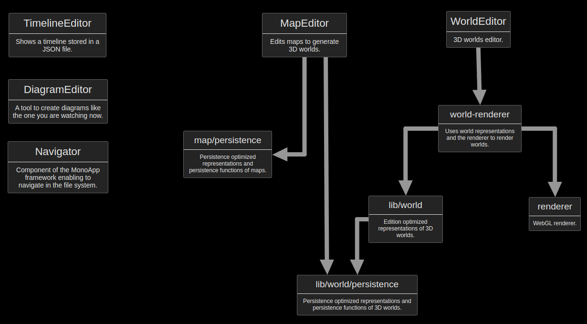

# MonoApp and applications

MonoApp is an modular application framework. But this repository also contains applications built with this framework...

## Applications

This repository contains:

- [A diagram quick editor](./doc/QuickDia.md).
- A timeline view. (experimental)
- A texture editor. (experimental)
- A 3D world editor. (experimental)

## MonoApp

MonoApp is a minimalist application framework working like an web operating system:

- "fs4webapp" is the backend providing access to the file system.

- "fontend" contains the frontend part of the framework and the applications.

Features ("applications") are triggered by opening a file type associated to them (like in a file explorer).

## Module overview and diagram example

## Important notes

The original repository is on bitbucket, and the one from github is updated by copy/pasting code. For this reason you cannot see all the commits on github.
