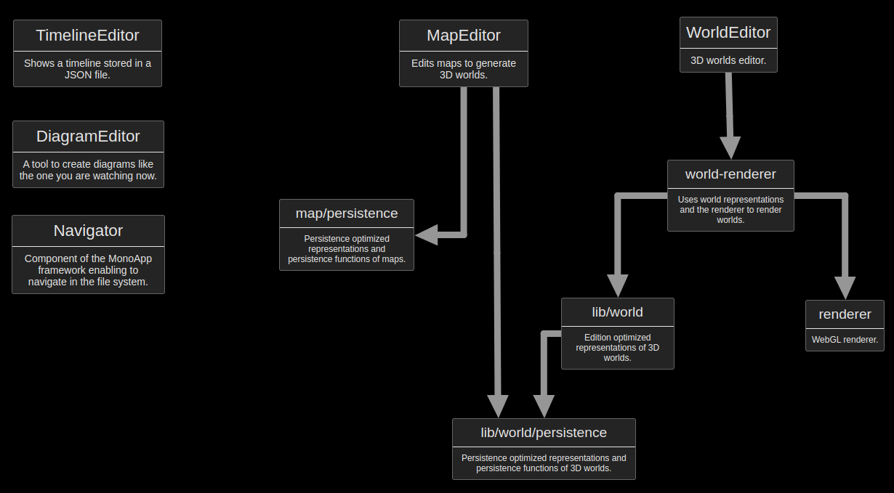

# MonoApp and applications

MonoApp is an modular application framework. But this repository also contains applications built around MonoApp.

## MonoApp

It's a minimalist application framework working like an web operating system:

- "fs4webapp" is the backend providing access to the file system
- "fontend" contains the frontend part of the framework and the applications 

## Modules

In the frontend, "lib" contains shared libraries and "features" entry points. The features include:

- A diagram editor
- A timeline editor (experimental)
- A 3D world editor (very experimental)

Features are triggered by opening a file type associated to them (like in a file explorer).

## Dependencies between modules

