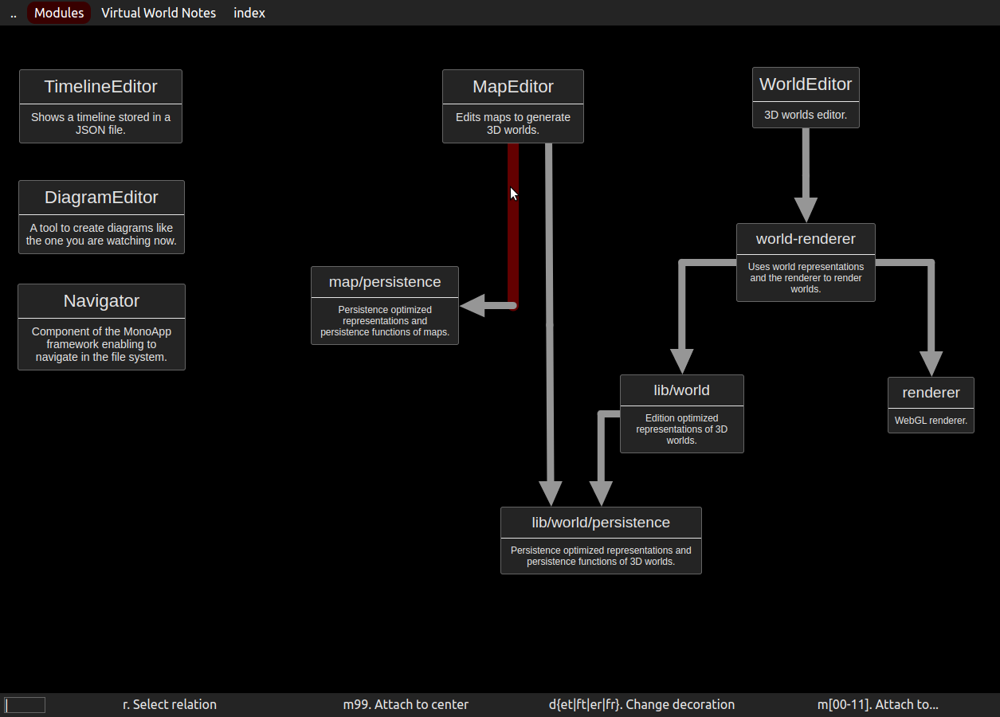

# Quick Dia

Designed to replace manual note taking, Quick Dia rely on very efficient keyboard shortcuts. Those shortcuts are contextually documented making it very easy to learn them.

Here you can see in the status bar shortcuts related to relation ends:

For instance, m\[00-11\] allows to move the end to one of the attach points of the rectangle it is attached to. Those points correspond to the hours on a clock.

Since the mouse is still the best tool to position things, there is, of course, a drag mechanism too.
